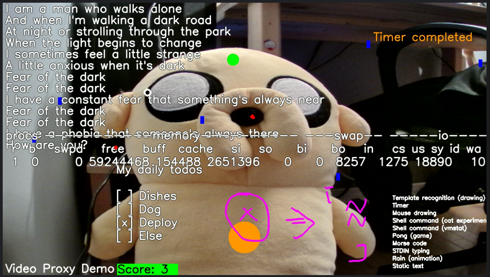

# Video Proxy

Video proxy learning project: a video output stream (~webcam) that is programmable in Python.

## Setup

- Install [OBS studio](https://obsproject.com/) and enable the virtual camera
- `python -m venv ./.venv`
- `. .venv/bin/activate`
- `pip install -r requirements.txt`

## Run

- `python main.py`

## Controls

- 0-9: output render pass toggle
- `: turn off all render pass
- -: turn on all render pass
- p: toggle PIP mode
- CTRL-C: exit

## Current plugins

- static text
- real time typed text
- animation (rain)
- game (pong)
- car recognition drawing
- red dot recognition drawing
- template recognition drawing
- shell command watchdog
- mouse drawing
- morse code translator
- countdown

## Wishlist

- faster image recognition
- static text pass:
  - position / color
- configurable size + frame rate
- typing pass to be keypress granular (no enter)
- (!) horizontal flip fix
